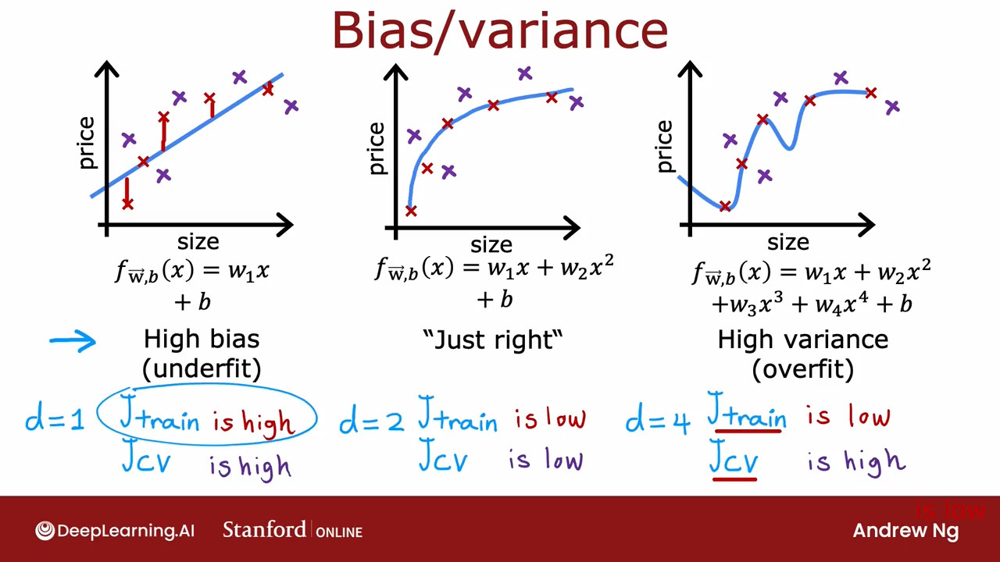
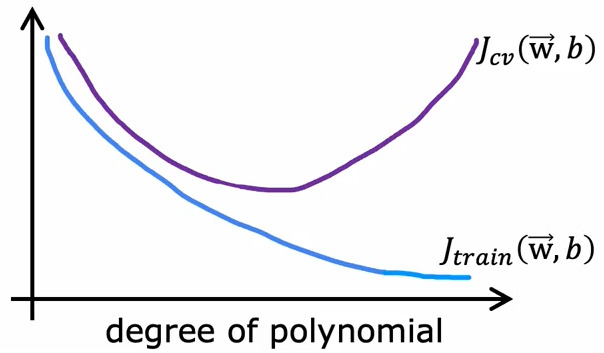
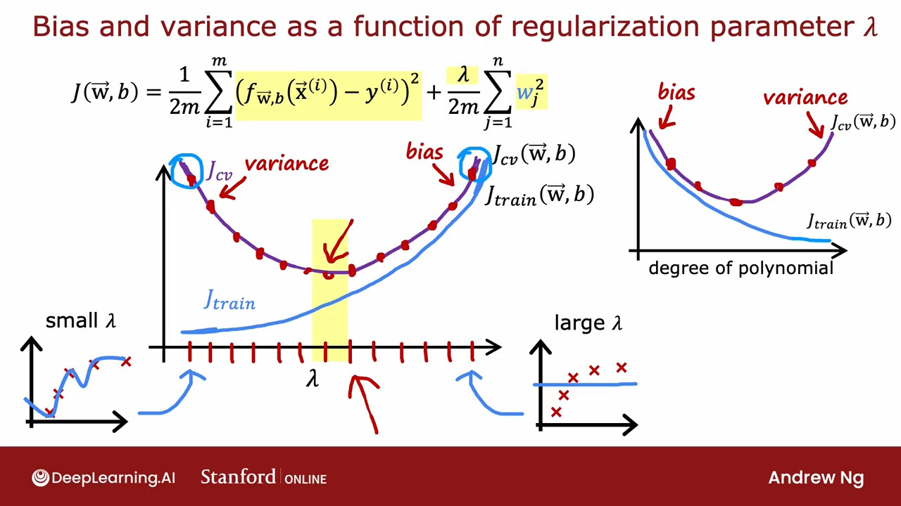
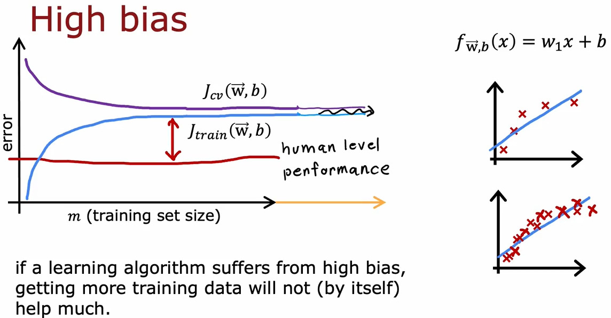
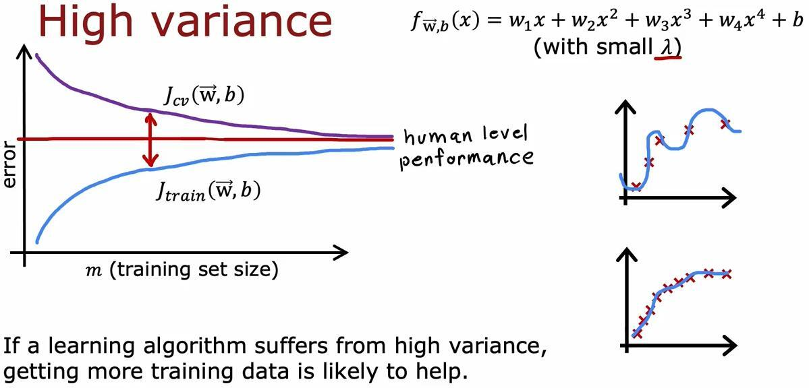
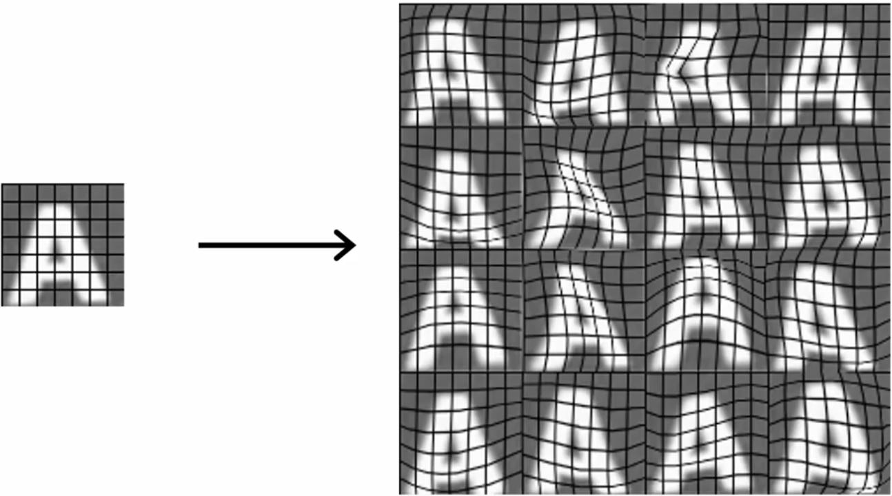
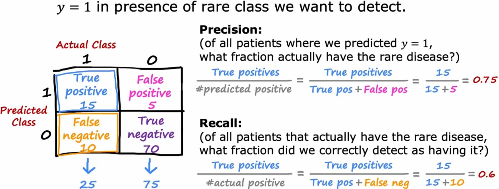
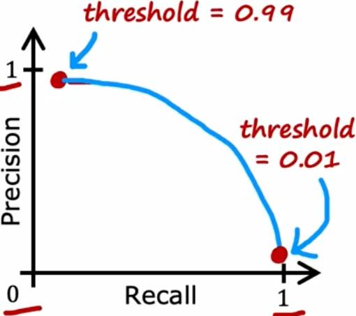

# Advise for applying machine learning

## Evaluating a model

We could detect the models issues by plotting the features and the predicting line, but as the number of features grows, plotting becomes harder.

Split the dataset into _training set_ and _test set_. Train the model on _training set_ and then evaluate the models performance by the test set.

1. Fit parameters by minimizing cost function $J(\vec{w}, b)$

    $$J(\vec{w}, b) = \left[\dfrac{1}{2m_{train}}\displaystyle\sum_{i=1}^{m_{train}}{(f_{\vec{w},b}(\vec{x}^{(i)})-y^{(i)})^2}+\dfrac{\lambda}{2m_{train}}\displaystyle\sum_{j=1}^{n}{w_j^2}\right]$$

2. Compute test error

    $$J_{test}(\vec{w}, b) = \dfrac{1}{2m_{test}}\left[\displaystyle\sum_{i=1}^{m_{test}}{(f_{\vec{w},b}(\vec{x}\_{test}^{(i)})-y_{test}^{(i)})^2}\right]$$

3. Compute training error

    $$J_{train}(\vec{w}, b) = \dfrac{1}{2m_{train}}\left[\displaystyle\sum_{i=1}^{m_{train}}{(f_{\vec{w},b}(\vec{x}\_{train}^{(i)})-y_{train}^{(i)})^2}\right]$$

If the $J_{train}$ is optimal and $J_{test}$ is high, the model's probably overfitting.

The same 1, 2, and 3 steps goes for classification models too, except the $J()$ function will change accordingly.  
there's also a more common way to calculate the $J_{train}$ and $J_{test}$ for classification problems:

$J_{train}$ is the fraction of _training set_ that has been misclassified.  
$J_{test}$ is the fraction of _test set_ that has been misclassified.

## Model selection and Training/Cross validation/Test sets

To choose the best model architecture amongst the models that we have defined, we could calculate the $J_{test}$ of all models and select the one with the least loss, but what if that architecture overfits and only performs well on the test set that you have provided?

In this approach, we split the model into 3 sets: _Training set_, _Cross validation set_, _Test set_. Then we train the models on _training set_ and select the best model based on _Cross validation error_ and then we could evaluate the accuracy of selected model by calculating the _Test set error_.

_tip)_ Cross validation set is also called _validation set_, _development set_ and _dev set_.  

_tip)_ We show the Cross validation cost function as $J_{cv}$.

_tip)_ Assign most of the data to the _training set_ and divide the rest between the _CV_ and _test_ sets

Training error: $\qquad J_{train}(\vec{w}, b) = \dfrac{1}{2m_{train}}\left[\displaystyle\sum_{i=1}^{m_{train}}{(f_{\vec{w},b}(\vec{x}^{(i)})-y^{(i)})^2}\right]$

Cross validation error: $\qquad J_{cv}(\vec{w}, b) = \dfrac{1}{2m_{cv}}\left[\displaystyle\sum_{i=1}^{m_{cv}}{(f_{\vec{w},b}(\vec{x}\_{cv}^{(i)})-y_{cv}^{(i)})^2}\right]$

Test error: $\qquad J_{test}(\vec{w}, b) = \dfrac{1}{2m_{test}}\left[\displaystyle\sum_{i=1}^{m_{test}}{(f_{\vec{w},b}(\vec{x}\_{test}^{(i)})-y_{test}^{(i)})^2}\right]$

It worth nothing that if the selected model performs bad on the _test set_ we can conclude that it's overfits and we can select the nex-best-model in _cross validation error_.

## Diagnosing bias and variance

Looking at the _bias_ and _variance_ of a model gives a really good insight of how the model is performing, but we can't easily plot the output of a model in order to detect high or low bias and variance; therefore a more systematic way to diagnose the algorithm would be to look at the performance of algorithm on the _training_ and _CV_ sets.

Bias = _Training error_ $\longrightarrow$ underfitting  
Variance = Difference between _training_ and _testing_ error $\longrightarrow$ overfitting





High bias:  
$J_{train}$ is high  
$J_{train} \approx J_{cv}$

High variance:  
$J_{cv} \gg J_{train}$  
$J_{train}$ may be low

High bias and variance(rare situation, where a part of the input _overfits_ and another part _underfits_):  
$J_{train}$ is high  
$J_{cv} > J_{train}$

## Regularization and bias/variance

$\text{Model:} \quad f_{\vec{w},b}(\vec{x}) = w_1x + w_2x^2 + w_3x^3 + w_4x^4 + b$

$\text{Cost:} \quad J(\vec{w},b) = \dfrac{1}{2m}\displaystyle\sum_{i=1}^{m}{(f_{\vec{w},b}(\vec{x}^{(i)})-y^{(i)})^2}+\dfrac{\lambda}{2m}\displaystyle\sum_{j=1}^{n}{w_j^2}$

By choosing a large $\lambda$, the effect of the quadratic function will be minimized and $f_{\vec{w},b}(\vec{x}) = b$.  
And by choosing a small $\lambda$, the effect of normalization will be minimized and the function will end up just as before.

To choose the best $\lambda$ we can train different models with different $\lambda$s on the _training set_ and select the best model based on _CV loss_ of each model.



## Estimating a baseline level of performance

To get an estimate of what's the good performance you need to determine a base line level of performance.

1. What's the level of error you can reasonably hope to get to?
   - Human level performance
   - Competing algorithms performance
   - Guess based on experience

If the difference between the _baseline level of performance_ and the _training error_ is high, it means you have _high bias_ problem.  
If the difference between the _training error_ and _CV error_ is high, it means you have _high variance_ problem.

## Learning curves

<image src="./assets/img-04.jpg" height="200px">

As the of _training set size_ grows, the _training error_ and _CV error_ converge and get lower.

_CV error_ will typically be higher than _training error_.



However if the model has a _high bias_ and underfits, throwing more data at it will not make it more accurate. The _CV_ and _training_ errors flatten and continue for infinity.



In the case of _high variance_, at the beginning, the _training error_ and _CV error_ get close to the _baseline accuracy level_ and the _training error_ might even converge with the _base level_ but _CV error_ is so high.

If we increase the _training set size_, both the training and CV error might converge and get a better performance.

## Deciding what to do next(revised)

So based on what we learns about high _bias_ and _variance_; we can do the following, if the algorithm has a _hight bias_:  

- Try getting additional features
- Try adding polynomial features
- Try decreasing $\lambda$

And the following, if the algorithm has a _hight variance_:

- Get more training examples
- Try smaller sets of features
- Try increasing the $\lambda$

> Bias and Variance are one of those concepts that take a short time to learn and a life time to master.

## Bias/Variance and neural networks

Although growing a neural network larger, increases the chance of overfitting; by choosing the right regularization, it almost always performs _better or at least equally good_ as the old model. But theres always the caveat of increasing the computational requirements.

Unregularized MNIST model:

```python
layer_1 = Dense(units=25, activation='relu')
layer_2 = Dense(units=15, activation='relu')
layer_3 = Dense(units=1, activation='sigmoid')
model = Sequential([layer_1, layer_2, layer_3])
```

Regularized MNIST model:

```python
layer_1 = Dense(units=25, activation='relu', kernel_regularizer=L2(1e-2))
layer_2 = Dense(units=15, activation='relu', kernel_regularizer=L2(1e-2))
layer_3 = Dense(units=1, activation='sigmoid', kernel_regularizer=L2(1e-2))
model = Sequential([layer_1, layer_2, layer_3])
```

_tip)_ The parameter of `L2()` is $\lambda$

Final notes:

- It almost always never hurts to have a larger neural network as long as you can effort the computational power
- As long as your training set isn't too large; the neural network(specially large neural network) is often a low bias machine and just fits complicated functions very well.

## Iterative loop of ML development

In the process of building a machine learning model, you may do the following iterative steps:

1. Choose architecture(model, data, etc.) [go to 2]
2. Train the model [go to 3]
3. Diagnostics(bias, variance, and error analysis) [go to 1]

## Error analysis

Error analysis consists of manually checking the misclassified examples from the CV set.

We can collect the misclassified examples and group them into common themes and properties.

If the misclassified examples are too many, we can randomly select around 100 of them.

After this process, we will get insights about what to do next, e.g. you might decide to collect more data that has the most repeated property, or increase the weight of that property.

## Adding data

It's always tempting to collect more data, but the process of collecting more data can be highly expensive; so instead we can collect a fewer data of just the type that _error analysis_ proved would be more helpful.

### Data augmentation

Instead of collecting, we can generate new data from those we already have; e.g. in an image dataset for detecting handwritten letters, we can:

- Rotate
- Enlarge
- Shrink
- Change contrast
- Mirror some of letters like A, O, W



Or in a more advanced way, place a grid on top of the image and create random warpings.

And in a speech recognition model, we can:

- Add different background noises to of the audio
- Convert the audio to a bad cellphone connection mode

But keep in mind that just adding random noises to image or audio will not help.

### Data synthesis

Synthesis: using artificial data inputs to create a new training example.

For example for a text recognition system, we can write different letters with different fonts and take screenshots with different backgrounds.

_tip)_ Synthetic data generation has been used mostly for computer vision

For many decades the focus has been on improving the model in order to improve the performance of the application, and this resulted in existing of many good algorithms today. Therefore sometimes it might be more fruitful to taking a _data centric approach_ in which we focus on engineering the data used by algorithms.

## Transfer learning: using data from a different task

Assume we want to create an application to classify the handwritten numbers, but we don't have enough data to train the model.  
We can instead of training a new model from base, use a pretrained model on a large dataset of a million images and a thousand classes that has a lot of parameters already and fine-tune it for your specific application.

To do this, we copy the model that already has $(W^{[1]}, b^{[1]}), \dots, (W^{[N]}, b^{[N]})$ parameters and change the output layer from 1000 units to only 10 units and change its parameters to fit our application.

we need to run an optimization algorithm, such as _Gradient decent_ or _Adam_, using the parameter values initialized from the previous layers.

There are two options to train the networks parameters:

1. Only train the _output layers_ parameters, $W^{[N]}, b^{[N]}$, by running an optimization algorithm, such as _Gradient decent_ or _Adam_, using the parameter values initialized from the previous layers.
2. Train _all the parameters_, $(W^{[1]}, b^{[1]}), \dots, (W^{[N]}, b^{[N]})$, and the hidden layers parameters will be initialized by the values you had trained on top.

Option 1 is better for a really small training examples, and option 2 might be better for a larger training set.

The idea behind transfer learning is that, by training a model on a large dataset, it hopefully has learned a lot of parameters for the earlier layers, then by transferring these parameters to a new neural network, it would start off with the parameters in a much better place.

The process of training a rather large model on a large dataset is called _Supervised pretraining_, and the second step is called _Fine tuning_.

**Why does it even work**?  
In each layer, the model learns about some features of the image, like Edges, Corners, Curves/Basic shapes, and etc. So just by changing the output layer, it would use those learned features to detect the final result that we want.

_tip)_ We should use the same input type as the original input type of pretrained model.

1. Download neural network pretrained on a large dataset with same input type as your application.
2. Further train(fine tune) the network on your own data

## Full cycle of a machine learning project

1. Scope project: Define project
2. Collect data: Define and collect data
3. Train model: Training, error analysis & [iterative improvement](#iterative-loop-of-ml-development)
4. Deploy in production: Deploy, monitor and maintain system

Deployment is to take the model and serve it in an _inference server_

## Fairness, bias and ethics

The model, based on the feed data, might output offensive results, e.g. a hiring tool that discriminated against women, biased bank loan approvals, toxic effect of reinforcing stereotypes.

ML model can be used to advantage in adverse use cases, e.g. making deepfake of people without their consent, generating fake content, spreading toxic speech, using ML for committing fraud.

### Guidelines

- Get a diverse team to brainstorm things that might go wrong, with emphasis on possible harm to vulnerable groups.
- Carry out literature search on standards/guidelines for your industry.
- Audit systems against possible harm prior to development.
- Develope mitigation plan(if applicable), and after deployment, monitor for possible harm.

## Error metrics for skewed datasets

In an application that should predict if a patient has a rare disease, 99% accuracy would not be impressive, i.e. if only 0.05% of the cases have that disease, only printing 0 would give us 99.5% accuracy!

### Precision/recall metrics



This metric is calculated with a $2 \times 2$ matrix _for binary classification_ applications, where the top 0 and 1 represent the actual value, and the side 0 and 1 represent the predicted value, and in each cell we have the number of corresponding items.

- True positive: actually _positive_ and predicted _positive_
- False negative: actually _positive_ and predicted _negative_
- True negative: actually _negative_ and predicted _negative_
- False positive: actually _negative_ and predicted _positive_

Precision is the fraction of true positive results among all the positive predictions made by the model. In other words, it measures _how accurate the model is when it predicts a positive outcome_.

Recall, on the other hand, is the fraction of true positive results among all the actual positive cases in the data. In other words, it measures _how well the model identifies positive cases_.

The closer the both precision and recall to 1, the better.

## Trading off precision and recall

Normally the threshold for binary classification is as follows:

- Predict 1 if $f_{\vec{w}, b}(\vec{x}) \geq 0.5$
- Predict 0 if $f_{\vec{w}, b}(\vec{x}) < 0.5$

But if the disease is fatal and its treatment is expensive, we might want to only classify the patient as sick, only if we're very confident:

- Predict 1 if $f_{\vec{w}, b}(\vec{x}) \geq 0.7$
- Predict 0 if $f_{\vec{w}, b}(\vec{x}) < 0.7$

In this case, we will get a _higher precision_ and _lower recall_, as the predicted positives will be more accurate but instead we'll miss some actually positive ones.



In another case, if the disease is easily treatable but would get worse if not, we may want to lower the threshold:

- Predict 1 if $f_{\vec{w}, b}(\vec{x}) \geq 0.3$
- Predict 0 if $f_{\vec{w}, b}(\vec{x}) < 0.3$

But in this case we'll get _lower precision_ and _higher recall_, because we'll guess more of the actual sick ones, but the chance of predicting a sick one healthy would also increase.

### $F_1\ \text{score}$

F1 score is a way to combine both precision and recall into a single score, so we can go with those values that result into the highest F1 score.

One way to combine precision and recall is to take the average, but it wont work well because a very high value would make up for a very low value. But $F_1\ \text{score}$ fixes this problem by putting emphasis on the lower value.

$$F_1\ \text{score} = \dfrac{1}{\dfrac{1}{2}(\dfrac{1}{P} + \dfrac{1}{R})} = 2\dfrac{PR}{P+R}$$

_tip)_ $\frac{PR}{P+R}$ is called _Harmonic mean_ in math, and is a way to take average by emphasizing on smaller values more.

| $\ddots$    | P    | R   | Avg   | $F_1\ \text{score}$ |
|-------------|------|-----|-------|---------------------|
| Algorithm 1 | 0.5  | 0.4 | 0.45  | 0.444               |
| Algorithm 2 | 0.7  | 0.1 | 0.4   | 0.175               |
| Algorithm 3 | 0.02 | 1.0 | 0.501 | 0.039               |
