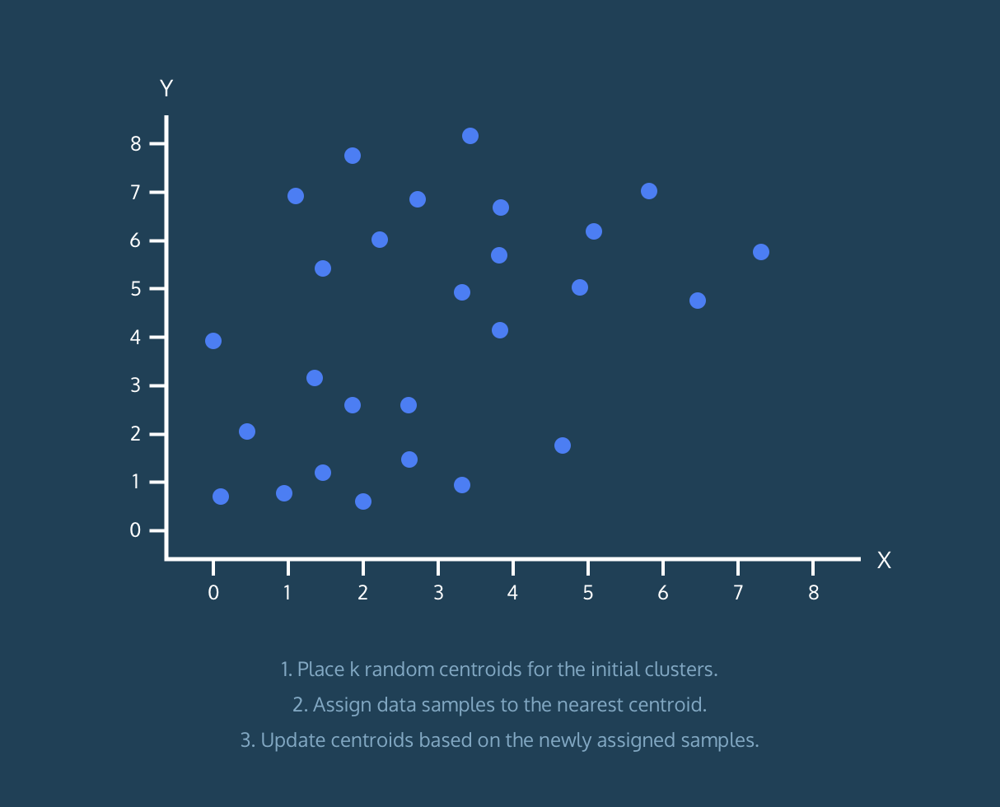
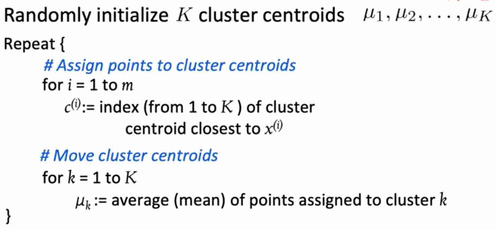
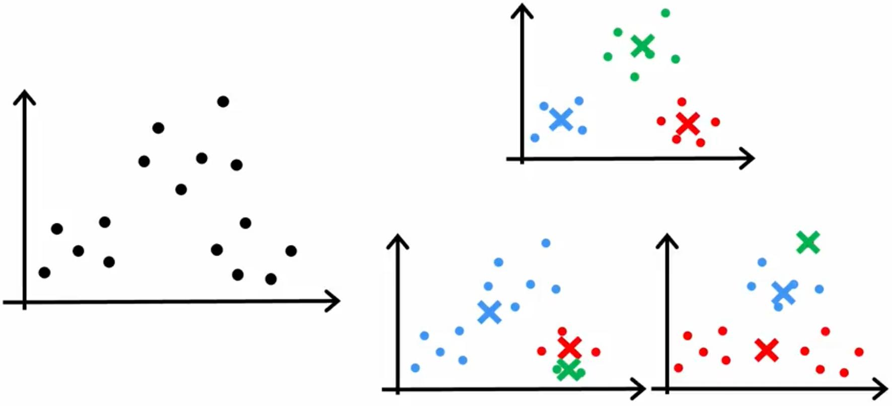
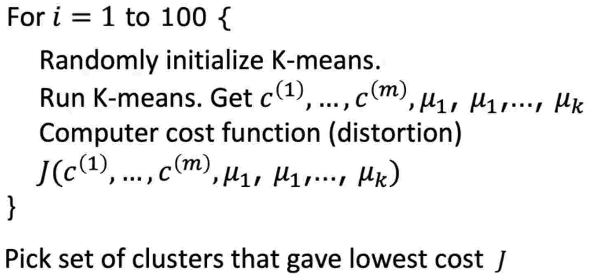
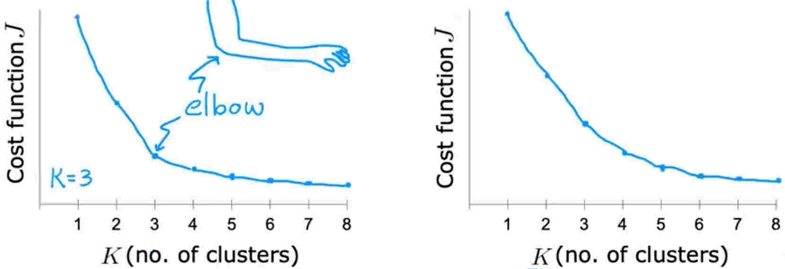
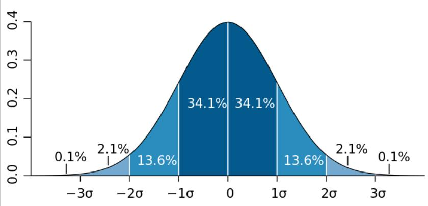
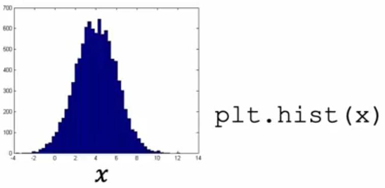
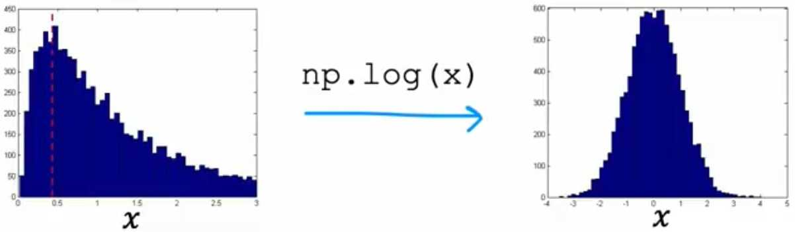
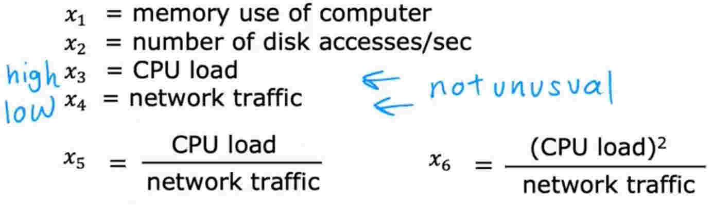

# Week 1 - Unsupervised learning

## K-means intuition

K-means algorithms tries to find the clusters or groups of similar examples in a dataset.

The way it does this operation for a two clusters is:

1. Pick two random points called _centroids_
2. Calculate the distance of examples from centroids, and relate each example to the closest centroid
3. Calculate the _mean_ of $(x, y)$ for corresponding points to each centroid
4. Move the centroids to the calculated means
   1. If the centroids didn't move, finish the job
   2. Else, go to step 2

## K-means algorithm

If no points where assigned to one of the randomly picked centroids at first, we can:

1. Remove the empty centroid
2. Randomly pick another centroid

_tip)_ We can even use the K-means algorithm in datasets with close examples.

## Optimization objective

$c^{(i)}$ = index of cluster ($1$, $2$, ..., $K$) to which example $x^{(i)}$ is currently assigned

$\mu_k$ = cluster centroid $k$

$\mu_{k^{(i)}}$ = cluster centroid $k$ of cluster to which example $x^{(i)}$ has been assigned

Cost function for K-means:

$$J(c^{(1)}, \dotsb, c^{(m)}, \mu_{1}, \dotsb, \mu_{K}) = \dfrac{1}{m} \displaystyle \sum_{i=1}^{m} ||x^{(i)} - \mu_{c^{(i)}}||^{2}$$

_note)_ In K-means algorithm, the cost is also called the _Distortion_, so the objective of cost function is minimizing the distortion

## Initializing K-means

One wat to choose the initializing centroids, is to randomly pick $K$ examples as centroids. In this way, based on the random initializing centroids, the output clusters may vary and may not be right.

One way to fix this problem, is picking multiple random initializing centroids and pick the set that gives in the least cost

Whereas in above algorithm, the number of random choices is set to 100, it's common to set it between 50 to 1000

## Choosing the number of clusters

Given that the clustering is an unsupervised process, the true number of clusters is totally ambiguous

Although there are a few mathematical ways to automatically choose the number of clusters, since the true number is totally ambiguous, it may only consume a lot of computational power for nothing.

### _Elbow method_

Plot the cost function versus the number of clusters and pick the one that the amount of decrease in cost function decreases a lot after it

_note)_ There might not be any significant drop in decreasing of cost and the plot goes down smoothly, so this method may not work

_tip)_ Try not to pick the one with least cost, because the amount of cost always decreases with increase of the number of clusters

## Gaussian(Normal) Distribution

Another name for this is _bell-shaped distribution_

The formula for a single feature $x$ is:

$$
\large{p(x) = \dfrac{1}{\sigma \sqrt {2 \pi}} e^{\dfrac{-\left({x - \mu }\right)^2}{2\sigma^2}}}
$$

Where

- $\sigma$ is the Standard division
- $\sigma^2$ is the Variance
- $\mu$ is the Mean
- $e$ is the Euler's number
- $\pi$ is the Pi

The normal distribution chart is:

The area under the chart is always equal to $1$, so:

- The $y$ axis, shows the probability
  - The two ends never become equal to absolute $0$
- When the $\sigma$ increases, the chart becomes taller and thinner
- When the $\sigma$ decreases, the chart becomes shorter

And the center is equal to $\mu$, so for normal distribution, $\mu = 1$

## Algorithm

For a multi-feature dataset, the gaussian distribution is calculated for each feature individually:

$$
p\left(\vec{x}\right) = p\left(x_1; \mu_1, \sigma^2_1\right) \times p\left(x_2; \mu_2, \sigma^2_2\right) \times p\left(x_3; \mu_3, \sigma^2_3\right) \times \dotsb \times p\left(x_n; \mu_n, \sigma^2_n\right) = \displaystyle{\Pi^{n}_{j=1}} p\left(x_j; \mu_j, \sigma^2_j\right)
$$

_note)_ As it shows, the algorithm works the best for features that are statistically independent, but often works fine for statistically dependent features too

_tip)_ This algorithm follows the _multiplication rule_ in probability

1. Choose $n$ features $x_i$ that you think might be indicative of anomalous examples
2. Fit parameters $\mu_1\dotsb\mu_n,\sigma^2_1\dotsb\sigma^2_n$

   $\mu_j = \dfrac{1}{m} \displaystyle \sum_{i=1}^{m} x_j^{(i)} \qquad \sigma_{j}^{2} = \dfrac{1}{m} \displaystyle \sum_{i=1}^{m} \left(x_{j}^{(i)} - \mu_{j} \right)^2$

   Vectorized formula:

   $\vec{\mu} = \dfrac{1}{m} \displaystyle \sum_{i=1}^{m} \vec{x}^{(i)}$

3. Given new examples $x$, compute
   $\large{p(x) = \displaystyle \prod_{j=1}^{n} p \left(x_{j}; \mu_{j}, \sigma_{j}^{2} \right) = \displaystyle \prod_{j=1}^{n} \dfrac{1}{\sigma_{j} \sqrt {2 \pi}}\ e^{\dfrac{-\left({x_{j} - \mu_{j}} \right)^{2}}{2\sigma^2_{j}}}}$
4. Anomaly if $p(x) < \epsilon$

## Developing and evaluating an anomaly detection system

Over the time, we can make sure of some anomaly examples in the gathered dataset, we can use these features to evaluate out anomaly detection system.

We can break the dataset into train/test/CV sets and adjust the $\epsilon$ on training set to fit the anomalous examples the best and then measure the overfit and accuracy by test/CV sets.

1. Fit model $p(x)$ on training set $x^{(1)}, x^{(2)}, \dotsb, x^{(m)}$
2. On a cross validation/test example $x$, predict $y = \begin{cases} 1 \quad \text{if} p(x) < \epsilon \text{(anomaly)} \\ 0 \quad \text{if} p(x) \geq \epsilon \text{(anomaly)} \end{cases}$

## Anomaly detection vs. supervised learning

### Differences

| Anomaly detection                                                                                                                                                                                                 | Supervised learning                                                                                                                                              |
|-------------------------------------------------------------------------------------------------------------------------------------------------------------------------------------------------------------------|------------------------------------------------------------------------------------------------------------------------------------------------------------------|
| Very small number of positive examples and large number of negative examples                                                                                                                                      | Large number of positive and negative examples                                                                                                                   |
| Many different "types" of anomalies. Hard for any algorithm to learn from positive examples what the anomalies look like; future anomalies may look nothing like any of the anomalous examples we've seen so far. | Enough positive examples for algorithm to get a sense of what positive examples are like, future positive examples likely to be similar to ones in training set. |

### Use cases

| Anomaly detection                                                                              | Supervised learning                                    |
|------------------------------------------------------------------------------------------------|--------------------------------------------------------|
| Fraud detection                                                                                | Email spam classification                              |
| Manufacturing - Finding new previously unseen defects in manufacturing(e.g. aircraft engines)  | Manufacturing - Finding known, previously seen defects |
| Monitoring machines in a data center                                                           | Weather prediction                                     |
|                                                                                                | Diseases classification                                |

## Choosing what features to use

Choosing a good feature in anomaly detection is more important than in supervised learning.

Here are some ways of feature engineering for anomaly detection:

### Non-gaussian features

Plot the histogram of features and see if they're gaussian or not

If thy're not, try to make them gaussian

Other than $\log$ function there are other ways too:

- $\log\left(x_2 + 1\right)$
- $\displaystyle\sqrt{x_3}$
- $\displaystyle x_4^{1/3}$

### Error analysis for anomaly detection

The most common problem is that an actual anomalous example doesn't get classified as anomaly. To fix this, we can think of a feature that we've missed to include and thus resulted in the misclassification.

For example, in fraud detection, based on the number of transactions, a user is classified as non-anomalous, but if we also consider the typing speed, we see that this user has an insanely faster typing speed than the normal users.

Another way to fix anomaly detection problem is combining features; for example in a data center, a server might have individually non-anomalous high CPU load and low network traffic, but if we combine these features into a new feature, we see that it's uncommon.

