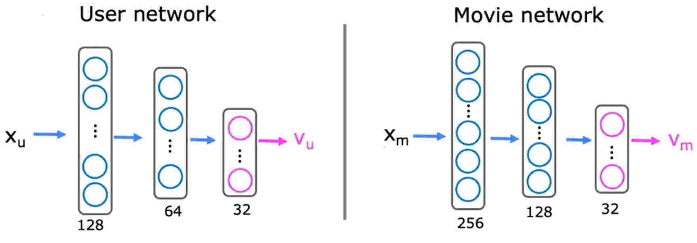
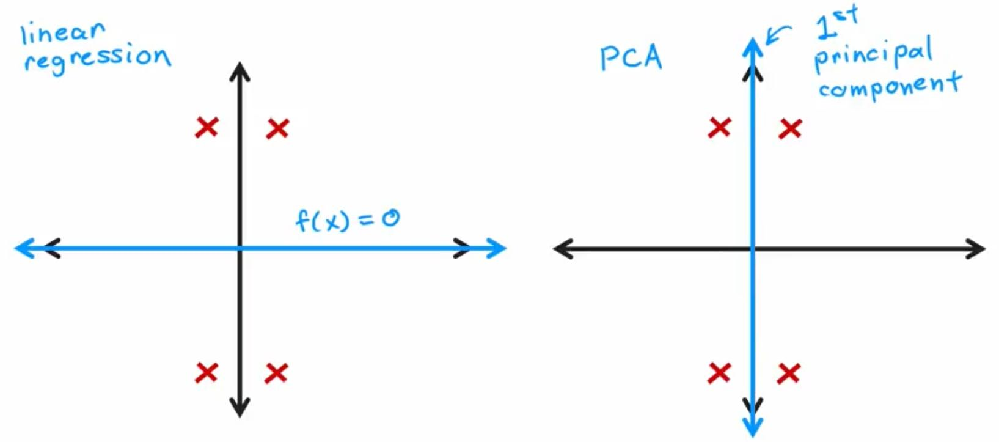

# Week 2 - Recommender systems

## Making recommendations

| Movie                | Alice(1) | Bob(2) | Carol(3) | Dave(4) |
| -------------------- | -------- | ------ | -------- | ------- |
| Love at last         | 5        | 5      | 0        | 0       |
| Romance forever      | 5        | ?      | ?        | 0       |
| Cute puppies of love | ?        | 4      | 0        | ?       |
| Nonstop car chases   | 0        | 0      | 5        | 4       |
| Swords vs. karate    | 0        | 0      | 5        | ?       |

Given the dataset above, we define the following notations:

- $n_u$ = no. of users
- $n_m$ = no. of movies
- $r(i, j) = 1$ if user $j$ has rated movie $i$
- $y^{(i, j)}$ = rating given by user $j$ to movie $i$ (defined only if $r(i, j) = 1$)

Now, given the users rated movies, we can predict the rating of other movies for that user and recommend him/her the highest predicted rating.

## Using per-item features

Lets add two features for movies

| Movie                | Alice(1) | Bob(2) | Carol(3) | Dave(4) | $x_1$ <br> (romance) | $x_2$ <br> (action) |
| -------------------- | -------- | ------ | -------- | ------- | -------------------- | ------------------- |
| Love at last         | 5        | 5      | 0        | 0       | 0.9                  | 0                   |
| Romance forever      | 5        | ?      | ?        | 0       | 1.0                  | 0.01                |
| Cute puppies of love | ?        | 4      | 0        | ?       | 0.99                 | 0                   |
| Nonstop car chases   | 0        | 0      | 5        | 4       | 0.1                  | 1.0                 |
| Swords vs. karate    | 0        | 0      | 5        | ?       | 0                    | 0.9                 |

Notation:

- $r(i, j) = 1$ if user $j$ has rated movie $i$ ($0$ otherwise)
- $y^{(i, j)}$ = rating given by user $j$ to movie $i$ (if defined)
- $\mathbf{w}^{(i)}, b^{(i)}$ = parameters for user $j$
- $x^{(i)}$ = feature vector for movie $i$
- $m^{(j)}$ = no. of movies rated by user $j$

For user $j$ and movie $i$, predict rating: $\mathbf{w}^{(j)} \cdot x^{(i)} + b^{(j)}$

**Cost function:**

$$
\large \underset{\mathbf{w}^{(j)} b^{(j)}}{\text{min}} J(\mathbf{w}^{(j)}, b^{(j)}) = \dfrac{1}{2} \displaystyle \sum_{i:r(i,j) = 1} \left(\mathbf{w}^{(j)} \cdot x^{(i)} + b^{(j)} - y^{(i, j)}\right)^2 + \dfrac{\lambda}{2} \displaystyle \sum_{k=1}^{n} \left(\mathbf{w}_{k}^{(j)}\right)^2
$$

_note)_ The $\displaystyle \sum_{i:r(i,j) = 1}$ denotes the sum of all movies $i$ that user $j$ has already rated

In recommendation systems, since $m^{(j)}$ is just a constant, it's convenient to use $\dfrac{\lambda}{2}$ instead of $\dfrac{\lambda}{2m^{(j)}}$ in divisions.

Now to learn parameters $\mathbf{w}^{(1)}, b^{(1)}, \dotsb, \mathbf{w}^{(n_u)}, b^{(n_u)}$ for all users:

$$
\large J
\begin{pmatrix}
    \mathbf{w}^{(1)}, \dotsb, \mathbf{w}^{(n_u)} \\
    b^{(1)}, \dotsb, b^{(n_u)} \\
\end{pmatrix}
= \dfrac{1}{2} \displaystyle \sum_{j=1}^{n_u} \displaystyle \sum_{i:r(i,j) = 1} \left(\mathbf{w}^{(j)} \cdot x^{(i)} + b^{(j)} - y^{(i, j)}\right)^2 + \dfrac{\lambda}{2} \displaystyle \sum_{j=1}^{n_u} \displaystyle \sum_{k=1}^{n} \left(\mathbf{w}_{k}^{(j)}\right)^2
$$

## Collaborative filtering algorithm

### Description

What if we didn't have the $x_1$ and $x_2$ features?

| Movie                | Alice(1) | Bob(2) | Carol(3) | Dave(4) | $x_1$ <br> (romance) | $x_2$ <br> (action) |
| -------------------- | -------- | ------ | -------- | ------- | -------------------- | ------------------- |
| Love at last         | 5        | 5      | 0        | 0       | ?                    | ?                   |
| Romance forever      | 5        | ?      | ?        | 0       | ?                    | ?                   |
| Cute puppies of love | ?        | 4      | 0        | ?       | ?                    | ?                   |
| Nonstop car chases   | 0        | 0      | 5        | 4       | ?                    | ?                   |
| Swords vs. karate    | 0        | 0      | 5        | ?       | ?                    | ?                   |

Where we don't have any feature for examples, but instead we have the users interaction for examples, we can use users interactions as a feature to even predict the feature users interactions and this is _collaborative filtering_.

In this example, although we don't have any features corresponding to each movie, we have the users ratings, and using these ratings beside the target users ratings, we can predict the feature ratings of the target user!

Given $\mathbf{w}^{(1)}, b^{(1)}, \dotsb, \mathbf{w}^{(n_u)}, b^{(n_u)}$  
to learn $x^{(i)}$:

$$
\large J(x^{(i)}) = \dfrac{1}{2} \displaystyle \sum_{j:r(i,j) = 1} \left(\mathbf{w}^{(j)} \cdot x^{(i)} + b^{(j)} - y^{(i, j)}\right)^2 + \dfrac{\lambda}{2} \displaystyle \sum_{k=1}^{n} \left(x_{k}^{(i)}\right)^2
$$

_note)_ Notice unlike the $J(\mathbf{w}^{(j)}, b^{(j)})$, we used $\displaystyle \sum_{j:r(i,j) = 1}$, to determine the sum all users $j$ that have rated the movie $i$ and the regularization term is also different

Now to learn $x^{(1)}, \dotsb, x^{(n_m)}$:

$$
\large J(x^{(1)}, \dotsb, x^{(n_m)}) = \dfrac{1}{2} \displaystyle \sum_{i=1}^{n_m} \displaystyle \sum_{j:r(i,j) = 1} \left(\mathbf{w}^{(j)} \cdot x^{(i)} + b^{(j)} - y^{(i, j)}\right)^2 + \dfrac{\lambda}{2} \displaystyle \sum_{i=1}^{n_m} \displaystyle \sum_{k=1}^{n} \left(x_{k}^{(i)}\right)^2
$$

### Algorithm

Cost function to learn $\mathbf{w}^{(1)}, b^{(1)}, \dotsb, \mathbf{w}^{(n_u)}, b^{(n_u)}$:

$$
\large \underset{\mathbf{w}^{(1)}, b^{(1)}, \dotsb, \mathbf{w}^{(n_u)}, b^{(n_u)}}{\text{min}}\ \dfrac{1}{2} \displaystyle \sum_{j=1}^{n_u} \displaystyle \sum_{i:r(i,j) = 1} \left(\mathbf{w}^{(j)} \cdot x^{(i)} + b^{(j)} - y^{(i, j)}\right)^2 + \dfrac{\lambda}{2} \displaystyle \sum_{j=1}^{n_u} \displaystyle \sum_{k=1}^{n} \left(\mathbf{w}_{k}^{(j)}\right)^2
$$

Cost function to learn $x^{(1)}, \dotsb, x^{(n_m)}$:

$$
\large \underset{x^{(1)}, \dotsb, x^{(n_m)}}{\text{min}}\ \dfrac{1}{2} \displaystyle \sum_{i=1}^{n_m} \displaystyle \sum_{j:r(i,j) = 1} \left(\mathbf{w}^{(j)} \cdot x^{(i)} + b^{(j)} - y^{(i, j)}\right)^2 + \dfrac{\lambda}{2} \displaystyle \sum_{i=1}^{n_m} \displaystyle \sum_{k=1}^{n} \left(x_{k}^{(i)}\right)^2
$$

Put them together:

$$
\large \underset{\begin{pmatrix} \mathbf{w}^{(1)}, \dotsb, \mathbf{w}^{(n_u)} \\ b^{(1)}, \dotsb, b^{(n_u)} \\ x^{(1)}, \dotsb, x^{(n_m)} \end{pmatrix}}{\text{min}}\ \dfrac{1}{2} \displaystyle \sum_{(i,j):r(i,j) = 1} \left(\mathbf{w}^{(j)} \cdot x^{(i)} + b^{(j)} - y^{(i, j)}\right)^2 + \dfrac{\lambda}{2} \displaystyle \sum_{j=1}^{n_u} \displaystyle \sum_{k=1}^{n} \left(\mathbf{w}_{k}^{(j)}\right)^2 + \dfrac{\lambda}{2} \displaystyle \sum_{i=1}^{n_m} \displaystyle \sum_{k=1}^{n} \left(x_{k}^{(i)}\right)^2
$$

### Gradient Descent

In collaborative filtering, the cost function is a function of $\mathbf{w}$, $b$ and $x$; so the optimization function should be so:

repeat: {

- $\mathbf{w}_{i}^{(j)} = \mathbf{w}_{i}^{(j)} - \alpha \dfrac{\partial}{\partial \mathbf{w}_{i}^{(j)}} J\left(\mathbf{w}, b, x\right)$
- $b^{(j)} = b^{(j)} - \alpha \dfrac{\partial}{\partial b^{(j)}} J\left(\mathbf{w}, b, x\right)$
- $x_{k}^{(i)} = x_{k}^{(i)} - \alpha \dfrac{\partial}{\partial x_{k}^{(i)}} J\left(\mathbf{w}, b, x\right)$

}

## Binary labels: favs, likes and clicks

In real-world applications, there are a lot of other features besides rating that can be used in recommendation systems and collaborative filtering.

| Movie                | Alice(1) | Bob(2) | Carol(3) | Dave(4) |
| -------------------- | -------- | ------ | -------- | ------- |
| Love at last         | 1        | 1      | 0        | 0       |
| Romance forever      | 1        | ?      | ?        | 0       |
| Cute puppies of love | ?        | 1      | 0        | ?       |
| Nonstop car chases   | 0        | 0      | 1        | 1       |
| Swords vs. karate    | 0        | 0      | 1        | ?       |

Here are some examples of what the binary numbers can mean:

- Did user $j$ purchase an item after being shown?
- Did user $j$ fav/like an item?
- Did user $j$ spend at least 30sec with an item?
- Did user $j$ click on an item?

### From regression to binary classification

- Previously:
  - Predict $y^{(i,j)}$ as $\mathbf{w}^{(j)} \cdot x^{(i)} + b^{(j)}$
- For binary classification:
  - Predict that the probability of $y^{(i,j)} = 1$ is given by $g(\mathbf{w}^{(j)} \cdot x^{(i)} + b^{(j)})$
  - Where $g(z) = \dfrac{1}{1 + e^{-z}}$

### Cost function for binary classification

- Previous cost function:
  - $\dfrac{1}{2} \displaystyle \sum_{(i,j):r(i,j) = 1} \left(\mathbf{w}^{(j)} \cdot x^{(i)} + b^{(j)} - y^{(i, j)}\right)^2 + \dfrac{\lambda}{2} \displaystyle \sum_{j=1}^{n_u} \displaystyle \sum_{k=1}^{n} \left(\mathbf{w}_{k}^{(j)}\right)^2 + \dfrac{\lambda}{2} \displaystyle \sum_{i=1}^{n_m} \displaystyle \sum_{k=1}^{n} \left(x_{k}^{(i)}\right)^2$
- Loss for binary labels: $y^{(i,j)}: f_{{\mathbf{w},b,x}}(x) = g(\mathbf{w}^{(j)} \cdot x^{(i)} + b^{(j)})$
  - $L(f_{{\mathbf{w},b,x}}(x), y^{(i,j)}) = - y^{(i,j)} \log \left(f_{{\mathbf{w},b,x}}(x)\right) - \left(1 - y^{(i,j)}\right) \log \left(1 - f_{{\mathbf{w},b,x}}(x) \right)$
  - $J(\mathbf{w}, b, x) = \sum_{(i,j):r(i,j) = 1} \left(f_{{\mathbf{w},b,x}}(x), y^{(i,j)} \right)$
  - Where $f_{{\mathbf{w},b,x}}(x) = g\left(\mathbf{w}^{(j)} \cdot x^{(i)} + b^{(j)} - y^{(i, j)}\right)$

## Mean normalization

First we add a new user Eve with no ratings:

| Movie                | Alice(1) | Bob(2) | Carol(3) | Dave(4) | Eve(2) |
| -------------------- | -------- | ------ | -------- | ------- | ------ |
| Love at last         | 5        | 5      | 0        | 0       | ?      |
| Romance forever      | 5        | ?      | ?        | 0       | ?      |
| Cute puppies of love | ?        | 4      | 0        | ?       | ?      |
| Nonstop car chases   | 0        | 0      | 5        | 4       | ?      |
| Swords vs. karate    | 0        | 0      | 5        | ?       | ?      |

The parameters that the current system will come up are: $\mathbf{w}^{(5)} = [0, 0] \quad b^{(5)} = 0$. So the Eves predicted ratings for all movies will be $0$, and it's not good.

### Algorithm

We will take all of ratings into a matrix and take the average of each row into a new vector $\mu$, and finally subtract the $\mu$ from initial ratings matrix:

$$
\begin{bmatrix}
    5 & 5 & 0 & 0  & ? \\
    5 & ? & ? & 0  & ? \\
    ? & 4 & 0 & ?  & ? \\
    0 & 0 & 5 & 4  & ? \\
    0 & 0 & 5 & ?  & ? \\
\end{bmatrix}
\qquad \mu =
\begin{bmatrix}
    2.5 \\
    2.5 \\
    2 \\
    2.25 \\
    1.25 \\
\end{bmatrix}
\qquad
\begin{bmatrix}
2.5   & 2.5   & -2.5 & -2.5  & ? \\
2.5   & ?     & ?    & -2.5  & ? \\
?     & 2     & -2   & ?     & ? \\
-2.25 & -2.25 & 2.75 & 1.75  & ? \\
-2.25 & -1.25 & 3.75 & -1.25 & ? \\
\end{bmatrix}
$$

And now the final matrix will be our new $y^{(i,j)}$, and the system will learn based on it.

Furthermore, because we subtracted $\mu$, for user $j$ on movie $i$, we predict: $\mathbf{w}^{(j)} \cdot x^{(i)} + b^{(j)} {\bf + \mu_{i}}$

Now even though we still have initial parameters of $\mathbf{w}^{(5)} = [0, 0] \quad b^{(5)} = 0$ for Eve, the resulting prediction will be $0 - \mu$, on which we can show him the highest rated movies at first.

_note)_ We can take the averages from columns too, but that would be useful when we want to predict the features of a new movie instead of a new user

## Tensorflow implementation of collaborative filtering

### Custom training loop

```python
w = tf.Variable (3.0)
x = 1.0
y = 1.0 # target value
alpha = 0.01

iterations = 30
for iter in range(iterations):
    # Use TensorFlow's Gradient tape to record the steps
    # used to compute the cost J, to enable auto differentiation.
    with tf.Gradient Tape () as tape:
        fwb = w * x
        costJ (fwb - y) **2

    # Use the gradient tape to calculate the gradients
    # of the cost with respect to the parameter w.
    [dJdw] = tape.gradient(costJ, [w])

    # Run one step of gradient descent by updating
    # the value of w to reduce the cost.
    w.assign_add(-alpha * dJdw)
```

### Implementation in TensorFlow

```python
#Instantiate an optimizer.
optimizer = keras.optimizers.Adam(learning_rate=1e-1)
iterations = 200
for iter in range (iterations):
    # Use TensorFlow's GradientTape
    # to record the operations used to compute the cost
    with tf.GradientTape () as tape:

        # Compute the cost (forward pass is included in cost)
        cost_value = cofiCostFuncV(X, W, b, Ynorm, R, num_users, num_movies, lambda)

    # Use the gradient tape to automatically retrieve
    # the gradients of the trainable variables with respect to the loss
    grads = tape.gradient(cost_value, [X, W, b])

    # Run one step of gradient descent by updating
    # the value of the variables to minimize the loss.
    optimizer.apply_gradients(zip(grads, [X, W, b]))
```

## Finding related items

The features $x^{(i)}$ of item $i$(user, movie, etc.) are quite hard to interpret. For example in the case of movies, it's hard to look at each movie individually and detect how much romance, action or any other genera it is. But collectively, we can predict its features.

To find other items related to it, find item $k$ with $x^{(k)}$ similar to $x^{(i)}$ with calculating their _squared distances_.

$$\displaystyle \sum_{l=1}^{n} \left(x_{l}^{(k)} - x_{l}^{(i)}\right)^2$$

The squared distance in mathematics is also shown as: $||x^{(k)} - x^{(i)}||^2$

### Limitations of collaborative filtering

Cold start problem. How to

- rank new items that few users have rated?
- show something reasonable to new users who have rated few items?

Use side information about items or users:

- Item: Genre, movie stars, studio, .
- User: Demographics (age, gender, location), expressed preferences, ...

## Collaborative filtering vs. Content-based filtering

- Collaborative filtering:

  Recommend items to you based on ratings of users who gave similar ratings as you

- Content-based filtering:

  Recommend items to you based on features of user and item to find good match

So based on the features of a movie ($X_m$) and user($X_u$), we'll have to come up with a two vectors with the same size ($V_m \And V_u$), so we can take the dot product of them.

Our approach to create the $V_m$ and $V_u$ will be deep neural networks.

## Deep learning for content-based filtering



We'll need two different networks, in order to generate the $V_m$ and $V_u$. Although the networks are different in input and hidden layers, the output size should be similar, so we can calculate the dot product of them in order to predict the $y^{(i, j)}$

$$
g(\mathbf{v^{(j)}_u} \cdot \mathbf{v^{(i)}_m})\ \text{to predict the probability that}\ y^{(i, j)}\ \text{is}\ 1
$$

Cost function:

$$
J = \sum_{i:r(i,j) = 1} (\mathbf{v^{(j)}_u} \cdot \mathbf{v^{(i)}_m} - y^{(i, j)})^2 + \text{NN regularization term}
$$

Learned user and item vectors:

- $\mathbf{v^{(j)}_u}$ is a vector of length 32 that describes user $j$ with features $\mathbf{x^{(j)}_u}$
- $\mathbf{v^{(i)}_m}$ is a vector of length 32 that describes movie $i$ with features $\mathbf{x^{(i)}_m}$


To find movies similar to movie $i$, find the movies with smallest squared error: $\left|\left|\mathbf{V^{(k)}_m} - \mathbf{V^{(i)}_m}\right|\right|^2$

_note)_ The can be run ahead of the time, meaning that it could be run over night to find all the similar movies to all movies and store them, in order to have a faster response when requested.

## Recommendation from a large catalogue

Running this algorithm every time a user shows up in the website would be computationally very expensive. 

1. Retrieval:
  - Generate large list of plausible item candidates e.g.
    1. For each of the last 10 movies watched by the user, find 10 most similar movies
    2. For most viewed 3 genres, find the top 10 movies
    3. Top 20 movies in the country
  - Combine retrieved items into list, removing duplicates and items already watched/purchased>
2. Ranking
   - Take list retrieved and rank using learned model
   - Display ranked items to user

One of the key decisions is how many items to retrieve.

- Retrieving more items results in better performance, but slower recommendations.
- To analyze the trade-off, we can carry out offline experiments to see if retrieving more items results in more relevant recommendations.

## Tensorflow implementation of content-base filtering

```python
user_NN = tf.keras.models.Sequential([
  tf.keras.layers.Dense(256, activation='relu'),
  tf.keras.layers.Dense(128, activation='relu'),
  tf.keras.layers.Dense(32)
])

item_NN = tf.keras.models.Sequential([
  tf.keras.layers.Dense(256, activation='relu'),
  tf.keras.layers.Dense(128, activation='relu'),
  tf.keras.layers.Dense(32)
])

# create the user input and point to the base network
input_user = tf.keras.layers.Input(shape=(num_user_features))
vu = user_NN(input_user)
vu = tf.linalg.l2_normalize(vu, axis=1)

# create the item input and point to the base network
input_item = tf.keras.layers.Input(shape=(num_item_features))
vm = item_NN(input_item)
vm = tf.linalg.l2_normalize(vm, axis=1)

# measure the similarity of two vector outputs
output = tf.keras.layers.Dot(axes=1)([vu, vm])

# specify the inputs and output of the model
model = tf.keras.Model([input_user, input_item], output)

# specify the cost function
cost_fn = tf.keras.losses.MeanSquaredError()
```

## Reducing the number of features

When we're dealing with a lot of features, say a thousand, we can't plot a 1000 dimensional graph to see how the features are related to each other. So we can use PCA to reduce the number of features to 2 or 3 and plot them.

Let's take a two feature set of examples for the sake of simplicity in explaining the PCA algorithm.

first we need to do some data preprocessing:

1. Normalize to have zero mean: subtract the mean from all the features
2. Feature scaling: normalize the ranges of features so the rages are not so far apart

Now we have to find the direction of the line that has the maximum variance. This is the direction that the data is most spread out along it. This is called the first principal component.

By maximum variance, we mean that when the line is drawn, when we project the data points on it, the sum of the squared distances of the projected points to the origin is maximum.

### Coordinate on the new axis

To find the coordinate of the data points on the new axis, we need to find the dot product of the data points and the length one vector (unit vector) of the line.

For example given $[x_1, x_2] = [2, 3]$ and unit vector of $[0.71, 0.71]$, the coordinate of $x_1$ and $x_2$ on the new axis would be $[2, 3] \cdot [0.71, 0.71] = 3.55$

### More principal components

Until now we only found the first principal component, but we can find the second principal component by finding the line that is perpendicular to the first principal component and has the maximum variance.

Perpendicular means that the dot product of the two lines is zero or in other words, two lines make a 90 degree angle.

### Difference between PCA and linear regression

In linear regression, we try to minimize the squared distance between the data points and the line. But in PCA, we try to maximize the squared distance between the data points and the line.

Furthermore, the linear regression is a supervised algorithm, but PCA is an unsupervised algorithm, meaning that unlike linear regression, we don't have a $y$ involved and theres just $x_1$ to $x_n$.



### Approximation to the original data

Given a $z$, to find the approximation of original $x_1$ and $x_2$ we can multiply the $z$ by the length one vector (unit vector) of the line.

For example given $z = 3.55$ and unit vector of $[0.71, 0.71]$, the approximation of $x_1$ and $x_2$ would be $3.55 \times [0.71, 0.71] = [2.52, 2.52]$

This is called the reconstruction step of the PCA.

## PCA in Code

0. First, optionally we need to perform feature scaling
1. `fit` the data to obtain 2 (or 3) new axes (principal components)
2. Optionally examine how much variance is explained by each principal component by `explained_variance_ratio` function
3. Transform (project) the data onto the new axis by `transform` function

Example:

```python
X = np.array([[1, 1], [2, 1], [3, 2],
              [-1, -1], [-2, -1], [-3, -2]])

pca_1 = PCA(n_components=1) # initialize with 1 principal component
pca_1.fit(X)
pca_1.explained_variance_ratio_

X_trans_1 = pca_1.transform(X)
X_reduced_1 = pca.inverse_transform(X_trans_1)
```

Output:
```
array([
[ 1.38340578],
[ 2.22189802],
[ 3.6053038 ],
[-1.38340578],
[-2.22189802],
[-3.6053038 ]])
```

### Application of PCA

While todays PCA is mostly used for visualization, it's been used for other things too:

- Data compression
  - We can reduce the number of features to save space
- Speeding up training of a supervised learning model
  - It's been useful for older machine learning algorithms like SVM, but with todays deep learning algorithmsq, it doesn't make much difference
