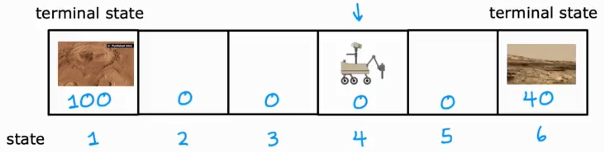
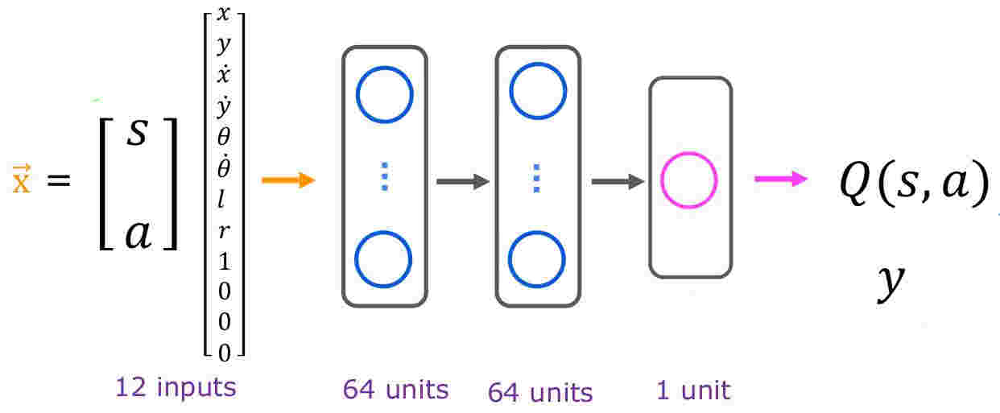
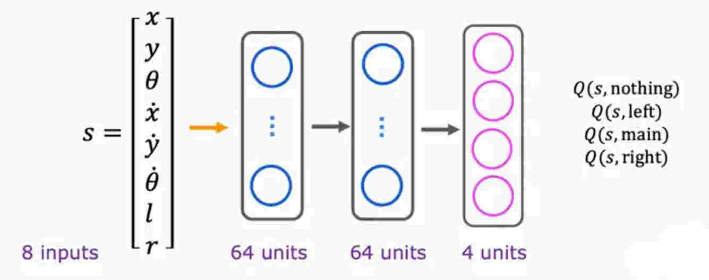
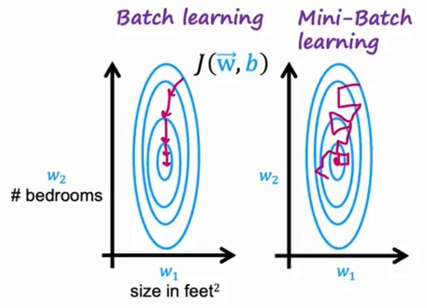
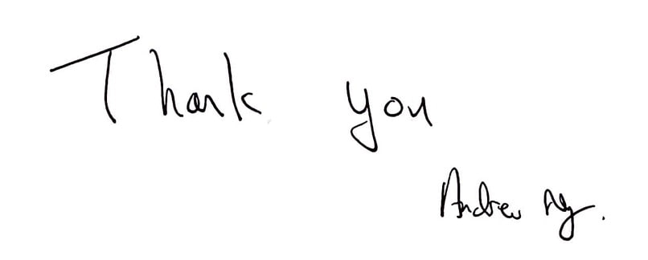

# Week 3 - Reinforcement learning

## What is Reinforcement Leaning

For the jobs like autonomous flying helicopter, we can't use supervised learning to train the model. Because we can't get the data set of the helicopter flying. So we need to use reinforcement learning to train the model.

In reinforcement learning, we don't have the data set. We only have the reward function. We can use the reward function to train the model.

In reinforcement learning, instead of telling the model what to do, we tell the model what is good and what is bad. Then the model will learn from the reward function.

Applications:

- Controlling robots
- Factory optimization
- Financial (stock) trading
- Playing games (including video games)

## Mars rover example

A robot is on Mars and it has to get to the goal. The robot can move forward or backward. In each step, the robot gets a reward. The robot has to get to the goal with the maximum reward.

The rewarded steps at the two ends, are called _terminal state_ because the robot can't move forward or backward from there.

At every time-step, the robot gets a reward. The robot is at state $s$, and it gets to choose an action $a$, and it gets a reward $R(s)$ and it gets to a new state $s'$: $(s, a, R(s), s')$

For example when robot is at state $4$, it take the action of going to the left, and gets $0$ reward, and then it will be at state $3$: $(4, \leftarrow, 0, 3)$

## The Return in reinforcement learning

The output of reward function may vary and we may have to take some steps without gaining any reward to reach a good reward at last, but what defines if it worth it or not?

Here we define _Discount Factor_ ($\gamma$) which is a little bit less than $1$ and we use it to define the return of the reward function.

For example with $\gamma = 0.9$, the total reward is:

$$
R = \sum_{k=0}^{\infty} \gamma^k r_{k+1}
$$

In financial application, the discount factor has a natural interpretation as the interest rate or the time value of money.

To summarize, the return is sum of the rewards that the system gets, weighted by the discount factor.

## Making decisions: Policies in reinforcement learning

A policy is a function $\pi(s) = a$ mapping from states to actions, that tells you what action a to take in a given state $s$.

Our goal reinforcement learning is to find a policy $\pi$ that tells you what action $a = \pi(s)$ to take in every state ($s$) so as to maximize the return.

## Review of key concepts

Markov Decision Process (MDP): This term refers to that the future only depends on the current state, not the past states. In other words, future only depends on what you are now, not how you got here.

## State-action value function definition

The state-action value function $Q(s, a)$ is the expected return starting from state $s$, taking action $a$, and then following policy $\pi$.

$Q(s, a)$ = Return if you

- start in state $s$
- take action $a$ (once)
- then behave optimally after that.

_note)_ State-action function is also called Q-function, Q*, and Optimal Q-function.

_note)_ The best possible return from state $s$ is $\underset{a}{\max} Q(s, a)$

_note)_ The best possible action in state $s$ is the action $a$ that gives $\underset{a}{\max} Q(s, a)$

## State-action value function example

Increasing the terminal reward will increase the Q-function value of moving toward that terminal state and makes it worth to walk toward it even if it takes a lot of steps.

On the other hand decreasing the discount factor $\gamma$ will make the algorithm more impatient and it will try to walk toward the closest reward.

## Bellman equation

- $s$: current state
- $a$: current action
- $R(s)$: reward of current state
- $s'$: state you get after taking action $a$
- $a'$: action that you take in state $s'$

$$
Q(s, a) = R(s) + \gamma \underbrace{\underset{a'}{\max} Q(s', a')}_{\text{discounted future reward}}
$$

_note)_ $R(s)$ is called _immediate result_

## Random (stochastic) environment

When there's a random environment, the possiblity of mars rover going to the right direction decreases from $1$, so the Q-function value of going to the right decreases. So the job of reinforcement learning is to find the best policy $\pi$ that maximizes the average of discounted reward.

$$
\text{Expected Return} = \text{Average}(R_1 + \gamma R_2 + \gamma^2 R_3 + \dots) = \mathbf{E}\left[R_1 + \gamma R_2 + \gamma^2 R_3 + \dots \right]
$$

- In statistics the _Expected_ is another term for average
- $\mathbf{E}$ refers to the expected value

Bellman equation for random environment:

$$
Q(s, a) = R(s) + \gamma\ \mathbf{E}[\underset{a'}{\max} Q(s', a')]
$$

## Learning the state-value function

To implement the deep reinforcement learning algorithm, we'll use a deep neural network with list of states and actions as input and the Q-function as output.

For example for the lunar lander example, the states could be: $s = [x, y, \dot{x}, \dot{y}, \theta, \dot{\theta}, l, r]$

Where:

- $x$: horizontal position
- $y$: vertical position
- $\dot{x}$: horizontal velocity
- $\dot{y}$: vertical velocity
- $\theta$: angle
- $\dot{\theta}$: angular velocity
- $l$: left leg contact with ground (binary)
- $r$: right leg contact with ground (binary)

And the actions could be a one-hot encoded vector as: $a = [\text{none}, \text{left}, \text{main}, \text{right}]$

Where:

- $\text{none}$: do nothing
- $\text{left}$: fire left orientation engine
- $\text{main}$: fire main engine
- $\text{right}$: fire right orientation engine

In these types of application, usually the discount factor $\gamma$ is close to $1$, e.g. $\gamma = 0.985$

So the recipe is: In a state $s$, use neural network to compute: $Q(s, \text{nothing}), Q(s, \text{left}), Q(s, \text{main}), Q(s, \text{right})$. Then choose the action with the highest Q-value.

But since this is a supervised learning problem, we need to initially have a dataset of $x$ as $[a, s]$ and $y$ as $Q(s, a)$. So we randomly generate a set of states, actions as input and the Q-function values as output and train the neural network. Hopefully the network learns the Q-function and we can use it to choose the best action in each state.

### Learning Algorithm

1. Initialize neural network randomly as guess of $Q(s, a)$
2. Repeat
   1. Take actions in lunar lander. Get $(s, a, R(s), s')$
   2. Store 10,000 most recent $(s, a, R(s), s')$ tuples (called _replay buffer_ or _experience replay_, applied to keep the best data and use less memory)
   3. Train neural network
      - Create training set of 10,000 examples using: $x = (s, a)$ and $y = R(s) + \gamma\ \underset{a'}{\max} Q(s', a')$
      - Train $Q_{\text{new}}$ such that $Q_{\text{new}}(s, a) \approx y$
   4. Set $Q = Q_{\text{new}}$

_note)_ This neural network is also called _DQN_ or _Deep Q-Network_

## Algorithm refinement: Improved neural network architecture

In above implementation, we'll have to carry out 4 inference steps per each Q-value. But we can do better by using a single inference step to get all the Q-values.

In state $s$, input $s$ to the network and pick the action that maximizes the $Q(s, a)$. $R(s) + \gamma\ \underset{a'}{\max} Q(s', a')$

In this implementation, a single neural network outputs all the Q-values.

## Algorithm refinement: $\epsilon$-greedy policy

In this implementation, we have to take steps in the environment to get the data to train the neural network. But we can do better by using a random policy to explore the environment and get the data to train the neural network.

### How to choose actions while still learning?

In some state s:

- Option 1:
  - Pick the action $a$ that maximizes $Q(s, a)$: In this approach we'll try to pick the best $a$ that minimizes our current guess of $Q(s, a)$
- Option 2:
  - With probability 0.95, pick the action a that maximizes $Q(s, a)$ (called _greedy, or exploitation step_)
  - With probability 0.05, pick an action $a$ randomly (called _exploration step_)

Since we've initially created a random dataset of $Q(s, a)$, we want to add a random policy to our algorithm to make sure that it explores even non-optimal actions and states, so hopefully it won't get stuck at a local minimum. In other words, this helps neural network to overcome it's own possible preconceptions about what might be a bad idea that isn't actually true.

The option two approach name is $\epsilon$-greedy policy with $\epsilon = 0.05$ 

A common practice is to set $\epsilon$ to a high value at the beginning of the training and then gradually decrease it to a low value.

## Algorithm refinement: Mini-batch and soft update

Given a dataset, to run the optimization algorithm in-order to minimize the total cost and learn the parameters, we have to iterate through the whole dataset per each optimization step, and this could be computationally very expensive if the dataset is too large. So we can use a mini-batch of the dataset to run the optimization algorithm and update the parameters. Meaning that we'll randomly pick a small batch of the dataset and run the optimization algorithm on that batch.

In our reinforcement learning algorithm case, we can apply the mini-batch approach by reducing the size of replay buffer from 10,000 to 1000:

1. Initialize neural network randomly as guess of $Q(s, a)$
2. Repeat
   1. Take actions in lunar lander. Get $(s, a, R(s), s')$
   2. Store 10,000 most recent $(s, a, R(s), s')$ tuples (called _replay buffer_ or _experience replay_, applied to keep the best data and use less memory)
   3. Train neural network
      - Create training set of **1000** examples using: $x = (s, a)$ and $y = R(s) + \gamma\ \underset{a'}{\max} Q(s', a')$
      - Train $Q_{\text{new}}$ such that $Q_{\text{new}}(s, a) \approx y$
   4. Set $Q = Q_{\text{new}}$

Although, this makes the optimization algorithm faster, but it makes the algorithm unstable.

### Soft Update

As said before, the mini-batch approach can make the model unstable. So we can reduce the impact of each mini-batch optimization iteration by using a soft update approach.

In the step 4 of the above algorithm, instead of replacing the old $Q$ with the new $Q_{\text{new}}$, we can update the old $Q$ with the new $Q_{\text{new}}$ by a small fraction of it.

Say if $Q$ is a function of $\mathbf{w}$ and $b$, we are going to update it as follows:

$$
\text{Set} \quad Q = 0.01 Q_{\text{new}} + 0.99Q \Rightarrow
\begin{cases}
    \mathbf{w} = 0.01 \mathbf{w_{\text{new}}} + 0.99 \mathbf{w} \\
    b = 0.01 b_{\text{new}} + 0.99 b
\end{cases}
$$

This makes the algorithm to converge more reliably. This approach applies to supervised learning as well.

## The state of reinforcement learning

Limitations of Reinforcement Learning:

- Much easier to get to work in a simulation than a real robot!
- Far fewer applications than supervised and unsupervised learning.

But... exciting research direction with potential for future applications.

